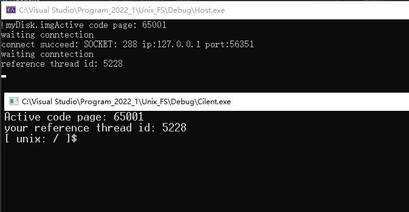
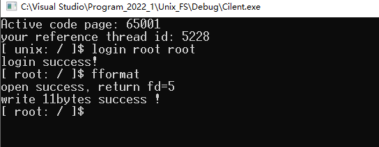
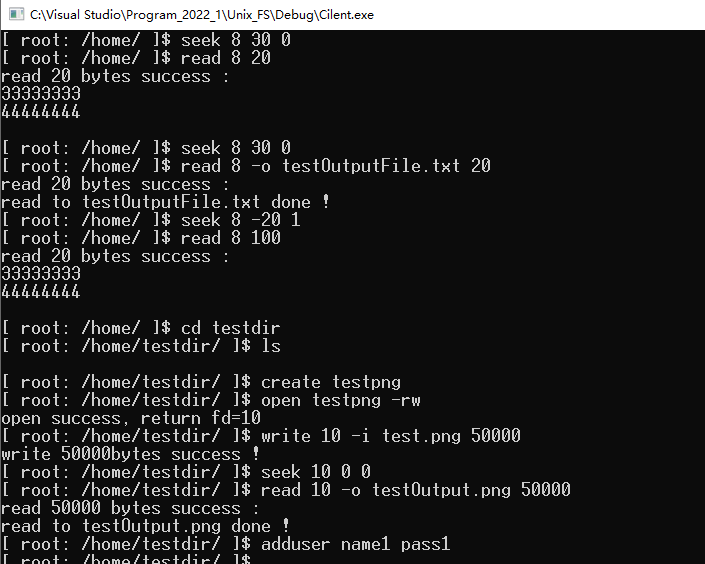
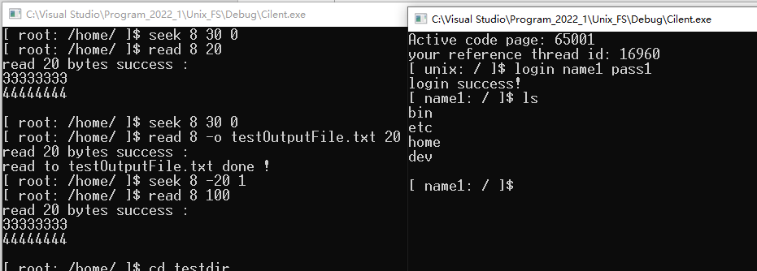
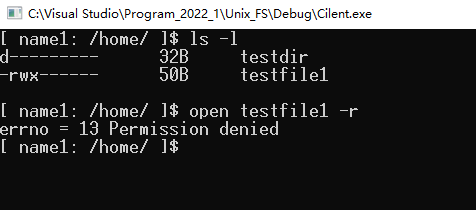
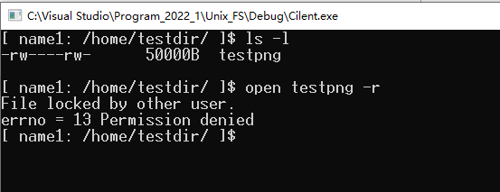
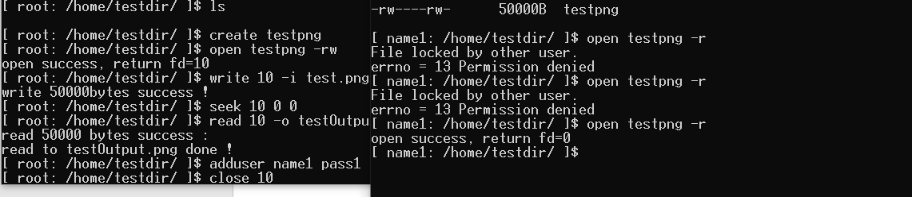
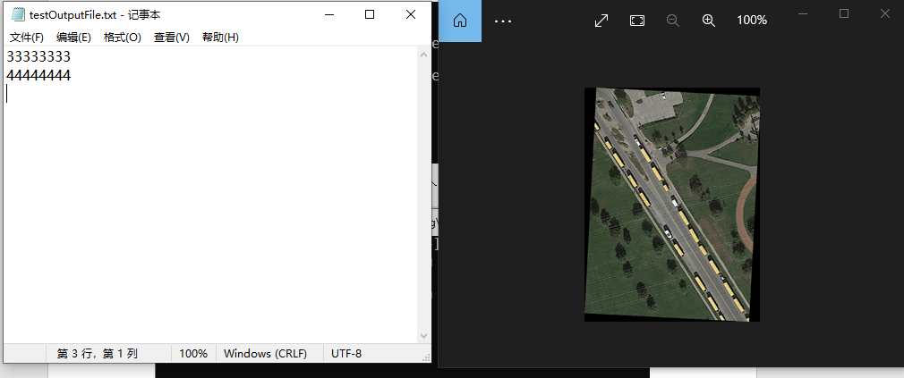

# MultiUser-Unix-FileSystem

## Introduction
 A UNIX-based second level file system that supports concurrent shell access by multiple users

## Our work
- Used an image file as virtual disk, realizing the function of mutual cross-system reading 
  and writing files
- Created session to achieve multi-user parallel access, implementing the communication 
  between shell and host
- Used BSD (flock) lock control file reading and writing permissions, supporting multithread
  access to the file system at the same time
- For more information, refer to [Project report](./resource/Project%20report.pdf).

## Install
### Compile with Integrated environment
- The VS2019 x86 integrated environment is recommended for compilation. The x64 version 
  is not supported. 
- Create the two folders [Host](./code/Host) and [Client](./code/Cilent) as two projects 
  and compile them to generate Host.exe and Client.exe, respectively. 
- For faster start, the Windows x86 running versions of both files have been published in 
  [this folder](./code).

### Makefile
- The Makefile.win file has the preset environment path. Therefore, you need to change 
  the g++ environment path of Makefile.win in the Host and Client folders to run the 
  compilation correctly. You need to change the following LIBS, INCS, and CXXINCS 
  directory paths.
```
CPP      = g++.exe -D__DEBUG__
CC       = gcc.exe -D__DEBUG__
WINDRES  = windres.exe
OBJ      = client.o
LINKOBJ  = client.o
LIBS     = -L"C:/C++/Dev C++/Dev-Cpp/MinGW64/x86_64-w64-mingw32/lib32" -lws2_32 -m32 -g3
INCS     = -I"C:/C++/Dev C++/Dev-Cpp/MinGW64/include" -I"C:/C++/Dev C++/Dev-Cpp/MinGW64/x86_64-w64-mingw32/include" -I"C:/C++/Dev C++/Dev-Cpp/MinGW64/lib/gcc/x86_64-w64-mingw32/4.9.2/include"
CXXINCS  = -I"C:/C++/Dev C++/Dev-Cpp/MinGW64/include" -I"C:/C++/Dev C++/Dev-Cpp/MinGW64/x86_64-w64-mingw32/include" -I"C:/C++/Dev C++/Dev-Cpp/MinGW64/lib/gcc/x86_64-w64-mingw32/4.9.2/include" -I"C:/C++/Dev C++/Dev-Cpp/MinGW64/lib/gcc/x86_64-w64-mingw32/4.9.2/include/c++"
BIN      = cilent.exe
CXXFLAGS = $(CXXINCS) -m32 -std=c++11 -g3
CFLAGS   = $(INCS) -m32 -std=c++11 -g3
RM       = rm.exe -f
 
.PHONY: all all-before all-after clean clean-custom
 
all: all-before $(BIN) all-after
 
clean: clean-custom
	${RM} $(OBJ) $(BIN)
 
$(BIN): $(OBJ)
	$(CPP) $(LINKOBJ) -o $(BIN) $(LIBS)
 
client.o: client.cpp
	$(CPP) -c client.cpp -o client.o $(CXXFLAGS)
```
- And run the following to compile
```
mingw32-make.exe -f ".\Makefile.win" clean all
```

## A running example
1. First, run Host.exe and then Client.exe to log in as a user
- 
2. Connect to the Host and Login. The default account is root(for both name and password) 
  and run fformat to format the hard disk
- 
3. Run auto to run automatic tests
- 
4. Open another client and log in to test concurrency
- 
5. Use another client to try to open an unauthorized file
- 
6. Use another client to try a file that was locked by the previous client
- 
7. After the previous client closes the file (unlock it), the other client can access the file
- 
8. Exit To save the file to img
9. Here is the file of the test output
- 
