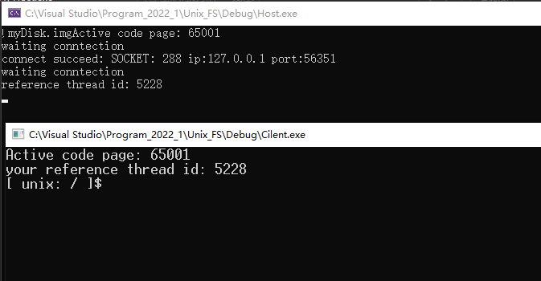
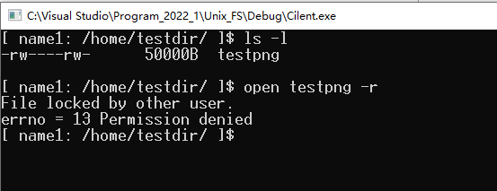

# 集成环境编译
- 推荐使用VS2019集成环境进行编译，分别将两个文件夹创建为两个项目，并分别编译得到Host.exe和Cilent.exe。
# Makefile
- 由于Makefile.win文件预置了环境路径，所以首先需要在Host和Cilent文件夹下，修改Makefile.win对应的g++环境路径，才能正确运行编译。需要修改以下的LIBS、INCS、CXXINCS目录路径。
```
CPP      = g++.exe -D__DEBUG__
CC       = gcc.exe -D__DEBUG__
WINDRES  = windres.exe
OBJ      = client.o
LINKOBJ  = client.o
LIBS     = -L"C:/C++/Dev C++/Dev-Cpp/MinGW64/x86_64-w64-mingw32/lib32" -lws2_32 -m32 -g3
INCS     = -I"C:/C++/Dev C++/Dev-Cpp/MinGW64/include" -I"C:/C++/Dev C++/Dev-Cpp/MinGW64/x86_64-w64-mingw32/include" -I"C:/C++/Dev C++/Dev-Cpp/MinGW64/lib/gcc/x86_64-w64-mingw32/4.9.2/include"
CXXINCS  = -I"C:/C++/Dev C++/Dev-Cpp/MinGW64/include" -I"C:/C++/Dev C++/Dev-Cpp/MinGW64/x86_64-w64-mingw32/include" -I"C:/C++/Dev C++/Dev-Cpp/MinGW64/lib/gcc/x86_64-w64-mingw32/4.9.2/include" -I"C:/C++/Dev C++/Dev-Cpp/MinGW64/lib/gcc/x86_64-w64-mingw32/4.9.2/include/c++"
BIN      = cilent.exe
CXXFLAGS = $(CXXINCS) -m32 -std=c++11 -g3
CFLAGS   = $(INCS) -m32 -std=c++11 -g3
RM       = rm.exe -f
 
.PHONY: all all-before all-after clean clean-custom
 
all: all-before $(BIN) all-after
 
clean: clean-custom
	${RM} $(OBJ) $(BIN)
 
$(BIN): $(OBJ)
	$(CPP) $(LINKOBJ) -o $(BIN) $(LIBS)
 
client.o: client.cpp
	$(CPP) -c client.cpp -o client.o $(CXXFLAGS)
```
- 运行以下进行编译
```
mingw32-make.exe -f ".\Makefile.win" clean all
```
# 运行
1. 首先打开host.exe，然后开启cilent.exe使用用户登录
- 
2. Login连接和格式化硬盘
- 
3. auto运行自动测试
- 
4. 打开另一个client，登录测试并发
- 
5. 使用另一个client尝试打开无权限文件 
- 
6. 使用另一个client尝试被前一个client上锁的文件 
- 
7. 前一个client关闭文件后（解锁），另一个client才能访问
- 
8. Exit退出即可保存文件到img
9. 测试输出的文件
- 
